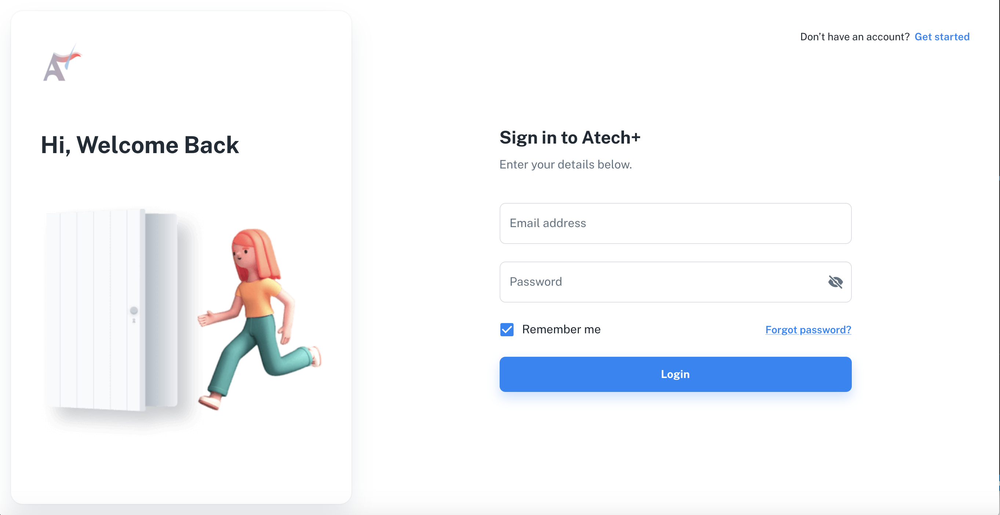
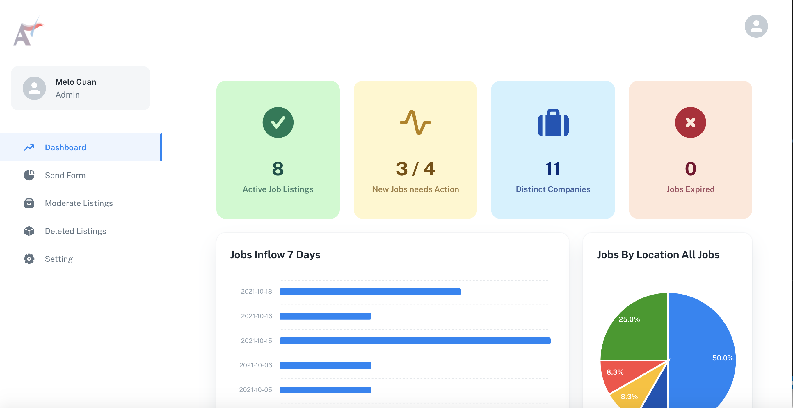
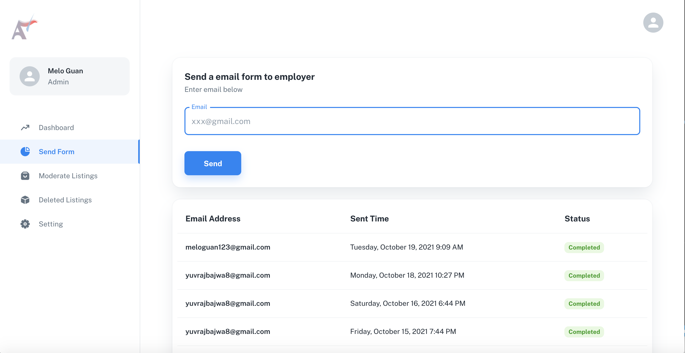
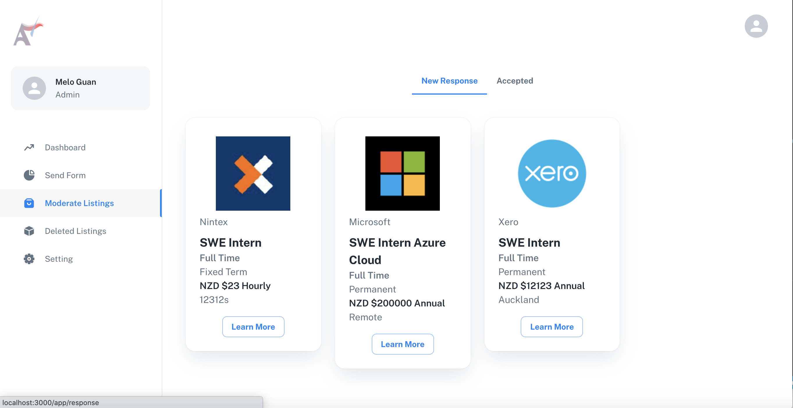
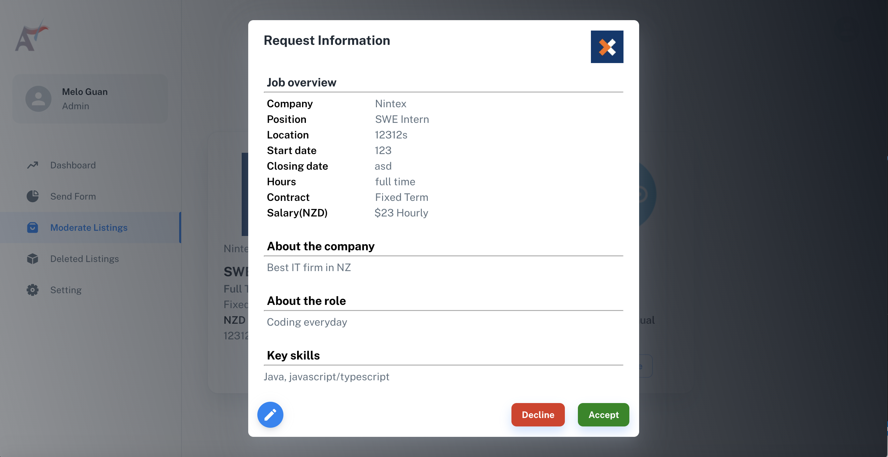
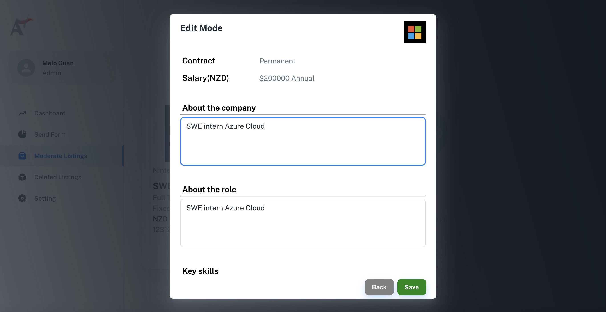
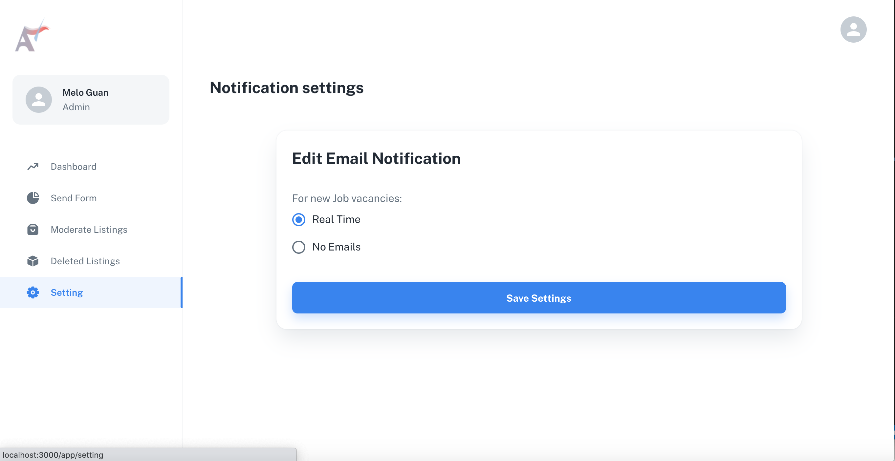
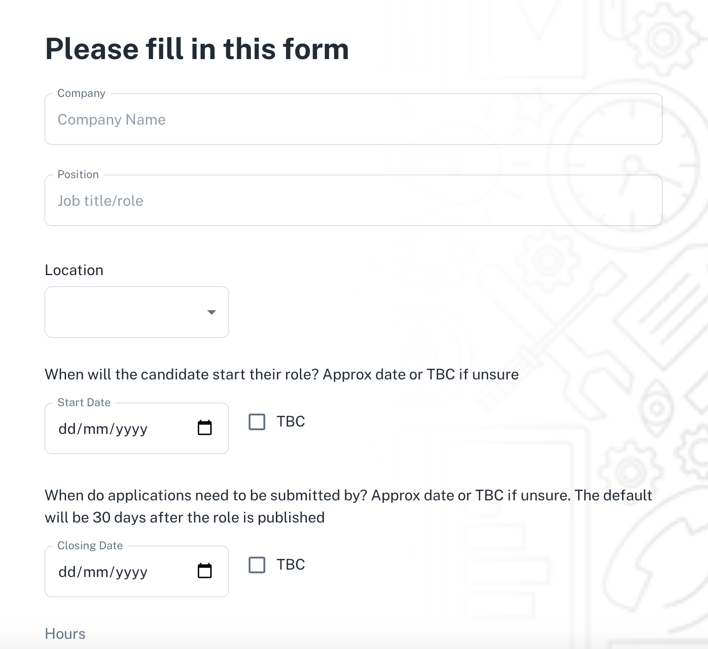

# Frontend Client Side of Online Job Board

Project Management Tool : [Trello CS399 Project: Team 15](https://trello.com/b/Vn3tMyRD/compsci-399-project-sprint-1-%F0%9F%9A%80-28-07-21-04-08-21)

## Description

This is the Project files for the Frontend catered for the the staff of UOA to manage the Online JobBoard for Computer Science Students. The Abilities of this Project is to:

- Register / Login to access the Website
- View analytic data
- Send email containing link to the form to employers
- Modify job listings
- Edit information for job deatial
- View deleted listings
- View Jobs in detail
- Settings for notification

## Technologies

- React : 17.0.2
- Material UI : 5.0.1
- eslint : 7.32.0
- yarn : 1.22.11
- node : 16.4.2
- javascript : ES6

## Instructions

### Download The projects

    Git clone https://github.com/uoa-compsci399-s2-2021/Team15-Backend.git
    Git clone https://github.com/uoa-compsci399-s2-2021/Team15-CRM-Frontend.git

### Installing the Dependencies

Installing Yarn (make sure you already have Node.js installed)
https://classic.yarnpkg.com/lang/en/docs/install/#windows-stable

### 1. Installing frontend Dependencies

> Open Team15-CRM-Frontend folder \
> In the CMD/ Terminal enter

    yarn install

> Open Team15-Backend folder \
> In the CMD/ Terminal enter

     yarn install

### 2. Running the servers

> Open Team15-CRM-Frontend folder \
> In the CMD/ Terminal enter

    yarn start

> Open Team15-Backend folder \
> in the CMD/ Terminal enter

     yarn run server

> Runs the app in the development mode.\
> Open [http://localhost:3000](http://localhost:3000) to view it in the browser.

## Examples

Here is the Deployed Website: [CRM Website URL](https://team15-crm.vercel.app):

### Login page

### Dashboard page

### Send Email consisting the form url to employer

### View and moderate job listings

### View request information

### Edit mode

### Setting Page

### Employer Form

## Future Plans

In the future we plan to add more features for the Admin, such as:

- More notification options
- Dark mode
- Enhance analytic section
- Other features.

## Acknowledgements

We Like to Thank our team members and everyone involved in the creation of this Project.

We also would like to Acknowledge:

- [Material UI Documentation](https://mui.com/getting-started/usage/)
- [React Documentation](https://create-react-app.dev/docs/documentation-intro)
- [Mozilla Developer Javascript Documentation](https://developer.mozilla.org/en-US/docs/Web/JavaScript)
- [w3 Schools Documentation](https://www.w3schools.com/css/default.asp)

I would say having access to these documentation webpages allowed us to implement this project as good as we have.